<div align="center">

# RL-Visual-Object-Tracking

### PPO-Based Visual Object Tracking using Reinforcement Learning and Deep Visual Features

</div>


## Overview

This project explores the intersection of Computer Vision and Reinforcement Learning for single-object visual tracking.

A PPO-based reinforcement learning agent is combined with deep visual representations extracted from a frozen ResNet-18 backbone to learn adaptive tracking behavior directly from video sequences.

Instead of relying on handcrafted motion rules or traditional tracking heuristics, the system learns a sequential decision-making policy that continuously updates object bounding boxes across frames.

The tracker was trained and evaluated on the OTB2015 benchmark, demonstrating how deep visual perception and reinforcement learning can be integrated into an end-to-end tracking framework.


## Features

- PPO-based visual tracking
- ResNet-18 feature extraction
- Reinforcement learning tracking pipeline
- IoU-based reward optimization
- Modular PyTorch implementation
- Real-time inference pipeline using OpenCV


## Tracking Pipeline

<div align="center">
  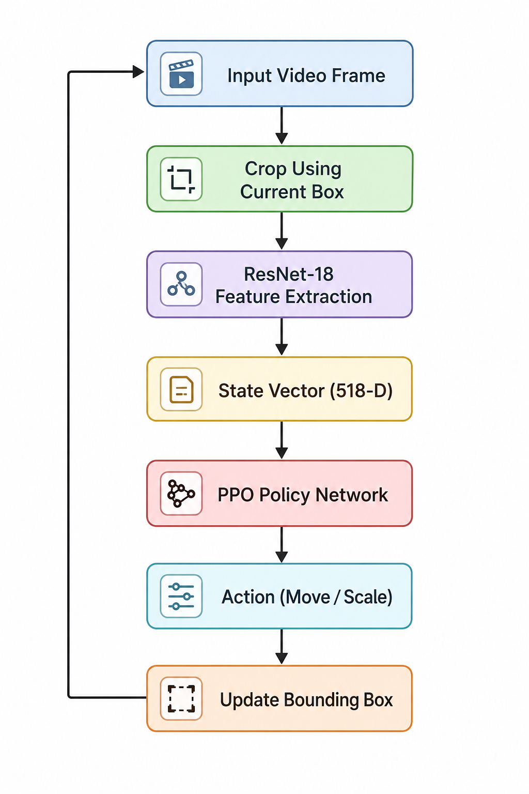
</div>


## Dataset Overview

The tracker was trained and evaluated on sequences from the OTB2015 benchmark dataset containing:

- Human motion
- Sports sequences
- Animals
- Vehicles
- Occlusions
- Scale variation
- Fast motion scenarios

<div align="center">
  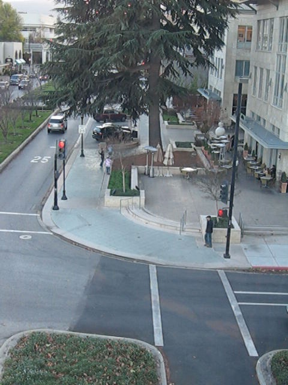
  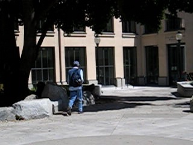
  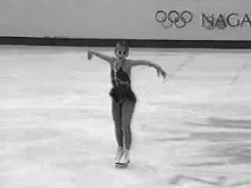
  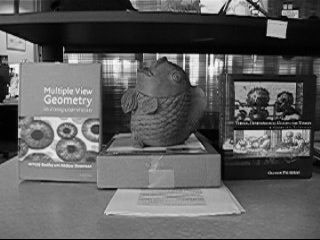
  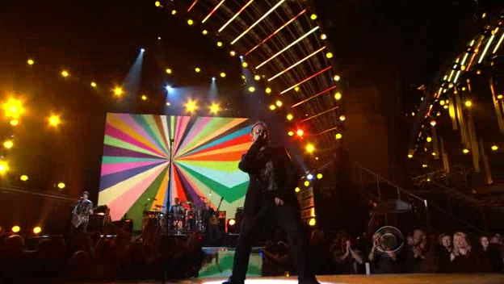
</div>


# Original vs Tracked Results

## Original Frames

<div align="center">

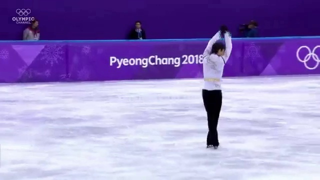

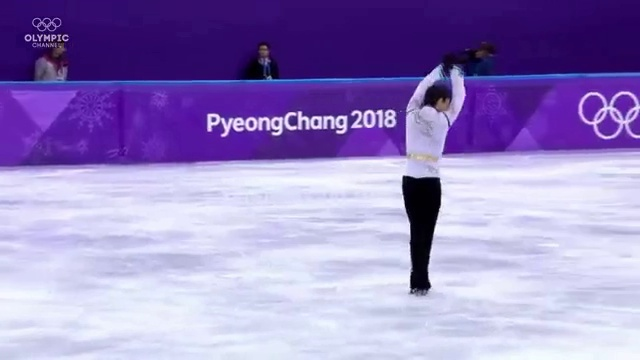

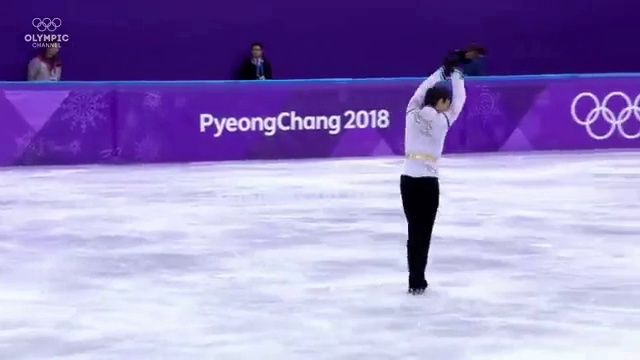
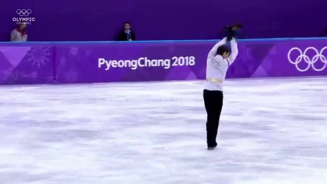
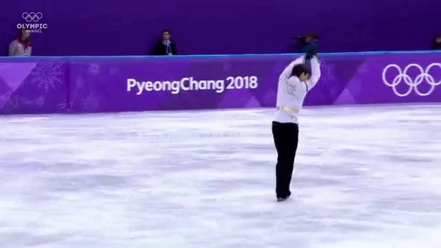

</div>


## PPO Tracking Output

<div align="center">

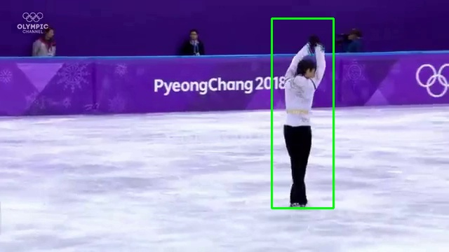
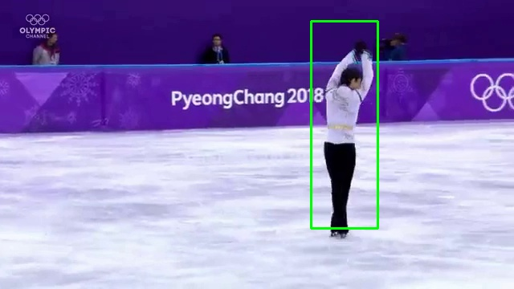


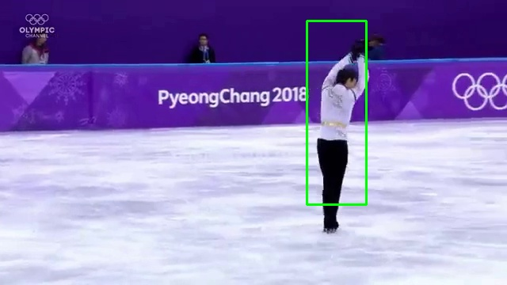
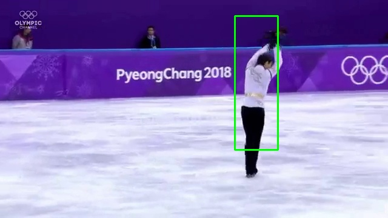


</div>


# Project Structure

```bash
RL-Visual-Object-Tracking/
│
├── assets/
│   ├── architecture/
│   ├── dataset_overview/
│   └── results/
│
├── src/
│   ├── dataset.py
│   ├── feature_extractor.py
│   ├── inference.py
│   ├── ppo_agent.py
│   ├── tracker_utils.py
│   └── train.py
│
├── requirements.txt
├── README.md
└── .gitignore
```


# Installation

```bash
git clone https://github.com/Pratyay1010/RL-Visual-Object-Tracking.git

cd RL-Visual-Object-Tracking

python -m venv .venv
```

### Windows

```bash
.venv\Scripts\activate
```

### Linux / MacOS

```bash
source .venv/bin/activate
```

Install dependencies:

```bash
pip install -r requirements.txt
```


# Run Inference

```bash
cd src
python inference.py
```


# Methodology

The tracking problem is formulated as a Markov Decision Process (MDP):

- State:
  - ResNet-18 visual features
  - normalized bounding box coordinates

- Actions:
  - move left
  - move right
  - move up
  - move down
  - scale up
  - scale down

- Reward:
  - Intersection-over-Union (IoU)

The PPO agent learns a tracking policy through sequential interaction with video frames.


# Future Improvements

- Continuous-action RL methods (SAC / TD3)
- Temporal memory using LSTMs or Transformers
- Multi-object tracking
- Automatic object initialization
- Domain randomization for robustness


# Tech Stack

- PyTorch
- OpenCV
- NumPy
- Torchvision
- Reinforcement Learning
- PPO
- ResNet-18


